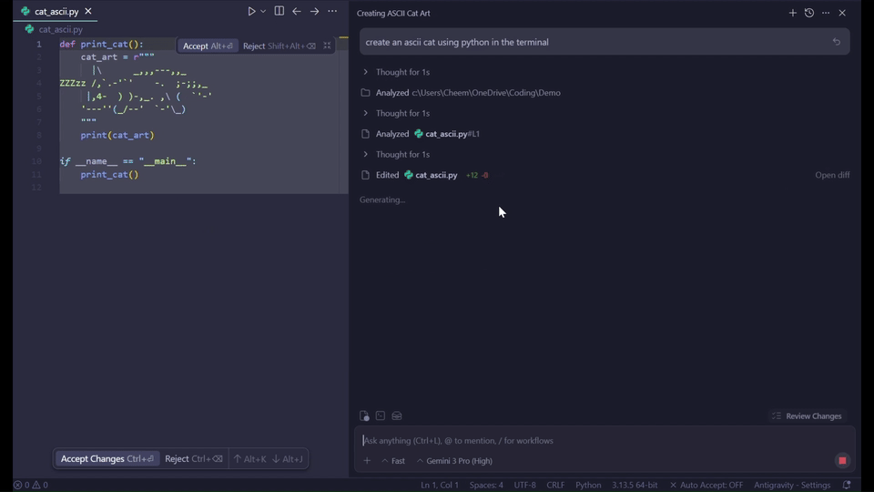
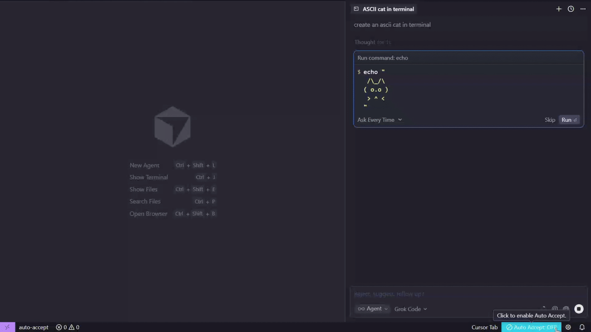

# Auto Accept Agent

Auto Accept Agent is an extension that instantly accepts agent file edits and terminal commands for you.

## Features
- Instant and performant
- Supports both Cursor and Antigravity
- One-click toggle from the status bar with a clear OFF highlight
- Works even when the window is not focused
- Configure settings via `Auto Accept: Settings & Pro` command

## Resilient Mode (Pro - $5/mo or $29/yr)
- **Auto-Recovery**: Automatically detects and recovers when the agent gets stuck (e.g. "buttons not clicking").
- **Background operation**: Works efficiently even when the window is not focused.
- **Multi-Instance**: Run multiple IDE windows simultaneously.
- **Adjustable Speed**: Fine-tune polling frequency to save ticks or maximize speed.
- **Analytics**: Track clicks and sessions saved.

## Installation
- Just click download if you are in Antigravity or Cursor already
- Install the vsix file locally if you are in VS code marketplace, then restart your IDE

